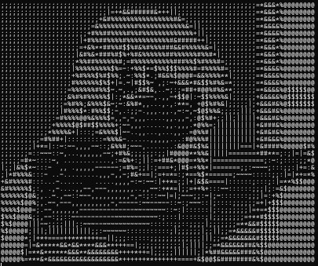

# 🎞️ ASCII GIF Player

Un lecteur de GIFs animés en ASCII dans le terminal, écrit en Python.  
Transforme chaque frame d’un GIF en caractères ASCII pour créer une animation rétro et stylisée.

## ✨ Aperçu

Une démo visuelle peut être ajoutée ici () :

## 🚀 Fonctionnalités

- Précalcul des frames pour une lecture fluide
- Optimisation de la taille et du rendu ASCII
- Support des GIFs transparents
- Adaptation à la taille du terminal (via `new_width`)
- Fonctionne sous Windows, Linux et macOS

## 🔧 Installation

1. Clone le repo :

```bash
git clone https://github.com/Eyub4k/ascii-gif-player.git
cd ascii-gif-player
```

```bash
pip install pillow numpy
```

## ▶️ Utilisation

Modifie le chemin dans le script principal :

```python
if __name__ == "__main__":
    gif_path = "chemin/vers/ton_fichier.gif"
    main(gif_path, new_width=80, frame_delay=0.08)
```

Puis lance :

```bash
python ascii_gif_player.py
```

## ⚙️ Paramètres

| Paramètre       | Description                                           |
|------------------|--------------------------------------------------------|
| `gif_path`       | Chemin vers le fichier `.gif`                         |
| `new_width`      | Largeur de l’image en caractères (défaut: 80)        |
| `frame_delay`    | Temps entre chaque frame (en secondes, défaut: 0.08) |

## 🧠 Fonctionnement

1. Redimensionnement et conversion en niveaux de gris.
2. Transformation des pixels en caractères ASCII, du plus sombre au plus clair.
3. Précalcul de toutes les frames pour lecture rapide.
4. Affichage continu dans le terminal avec nettoyage entre chaque frame.

## 📁 Structure

```
ascii_gif_player.py
requirements.txt
README.md
```

## ✅ À faire (ToDo)

- [ ] Support des vidéos (`.mp4`) vers ASCII animé
- [ ] Contrôle clavier (pause, reprendre)
- [ ] Export en `.txt` ou `.mp4` ASCII
- [ ] Couleur (en utilisant ANSI escape codes)

## 🙌 Crédits

Créé par **Eyub Celebioglu**  
Inspiration : l’amour des animations rétro et de l’art ASCII.
